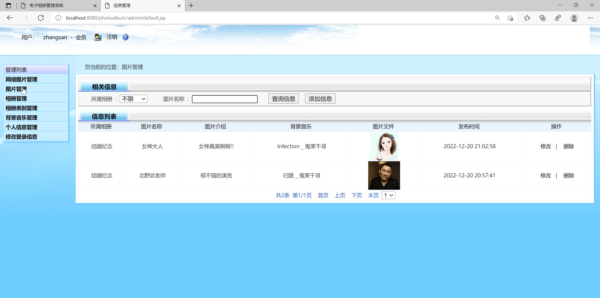

## (程序+报告)

###  获取sql数据库文件: 从戎源码网 (https://armycodes.com/) QQ: 386869957 QQ群: 377586148
###  所有系统地址: (https://github.com/YuLin-Coder/AllProjectCatalog) 
###  所有项目以及源代码本人均调试运行无问题 可支持远程安装部署调试、定制修改、代码讲解

## 项目介绍
基于JavaWeb的相册管理系统，该电子相册采用B/S结构，使用JAVA开发语言，结合JSP技术，以MySQL作为后台数据库。
该系统包括前端用户界面和后台管理。

1.前台系统界面
主要面向终端用户，并实现用户注册，网站介绍，站场动态，用户相册，空间共享和在线交流等功能。
2.后台管理系统
主要面向系统管理员，并实现了成员管理，公告管理，网络图像管理，照片管理，相册管理，管理员信息管理和站场动态等功能。
## 项目技术
- 编程语言：Java
- 数据库：MySQL
- 前端技术：JSP、JavaScript、bootstrap、JQuery
- 后端技术：Servlet、JDBC

## 运行环境
- JDK版本：JDK1.8及以上
- 开发工具：IDEA、Ecplise、Myecplise都可以
- 数据库: MySQL5.7及以上

## 运行截图

